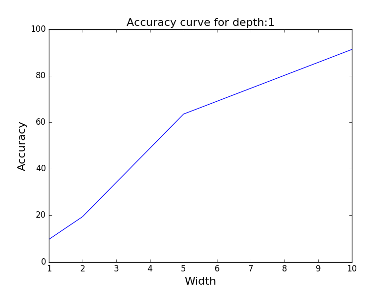
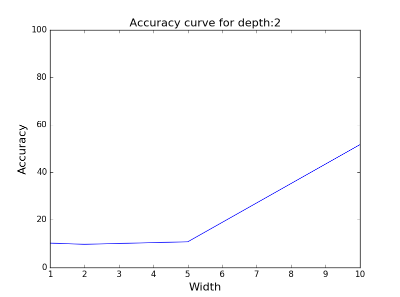
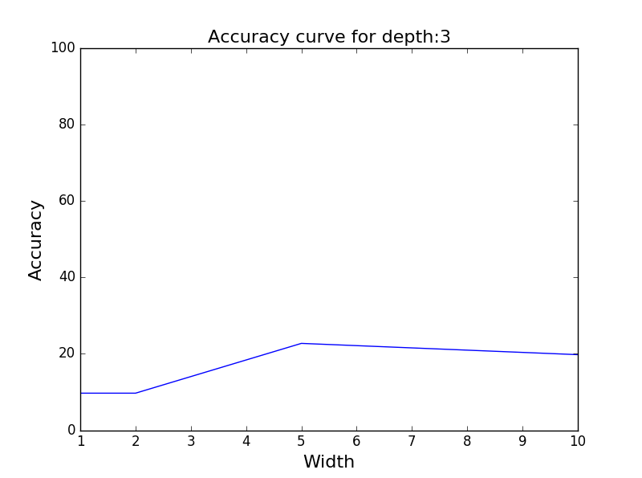
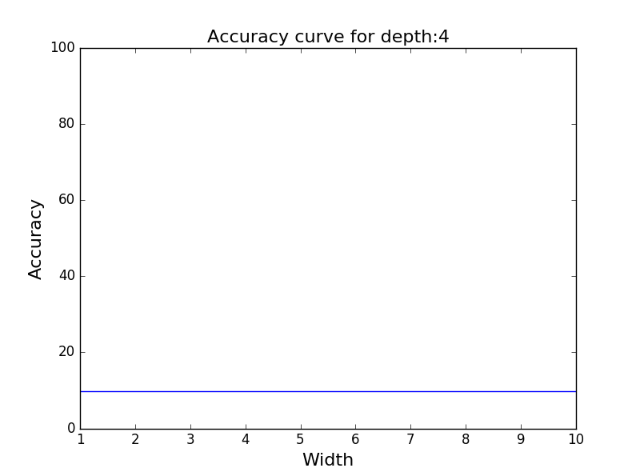

# Artificial Neural Network Backpropagation
- Backpropagation Algorithm
- Performance with different Network structures

In this project, I have implemented the Backpropagation algorithm for neural networks to classify handwritten digits. Then, evaluated its performance on network architectures with different depths and widths.
 
The accuracy of the network varies a lot when depth is 0 and there’s no width. Mostly, I have seen variation between 10 to 40 %. When depth is 1, the accuracy increases with width and goes up to ~92%. I have observed the best performance in this case. When depth is 2, the accuracy increases with width and goes up to ~ 35 to 40%. When depth is 3, the accuracy increases with width and goes up to ~ 30 to 35%. When depth is 4, the accuracy does not improve at all and is constant at 9.68%.
 

